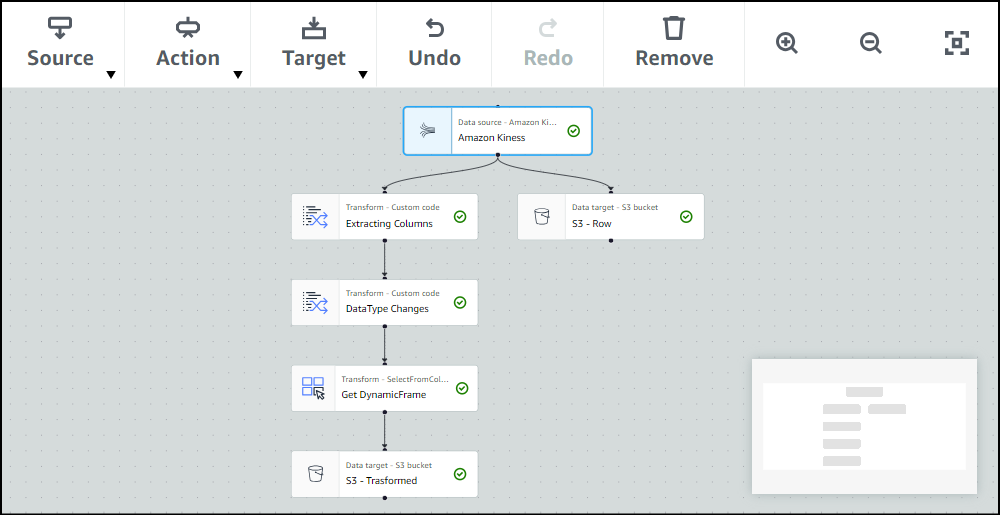

# Streaming Data Pipeline with AWS Glue

## Overview

This repository contains code and documentation for a streaming data pipeline built using AWS services and technologies. The pipeline efficiently captures, processes, and visualizes streaming data for robust business analytics.

## Project Steps

### 1. Real-time Data Extraction with EC2 Instance

- Implemented an EC2 instance for real-time data extraction using Python.
- Ensure the EC2 instance is set up with the necessary Python libraries and configurations.

### 2. Data Flow Optimization with Kinesis

- Optimize data flow using a Kinesis producer for efficient data capture and transfer.
- Ensure the Kinesis stream is correctly configured to handle the data volume.

### 3. End-to-End Advance Data Processing with AWS Glue and Spark

- Leverage AWS Glue and Apache Spark for end-to-end data processing.
- Includes extraction, cleansing, processing, transformation, and storage of data.

### 4. Persistent Storage in S3 Data Lake

- Configure the AWS Glue and Spark pipeline to store processed data directly into an S3 bucket, applying effective partitioning strategies for optimized data retrieval.
- Enforce fine-grained access controls and implement comprehensive monitoring to ensure the security and integrity of the stored data in the S3 data lake.

### 5. Advanced Analytics with AWS Athena

- Set up AWS Athena to seamlessly query data stored in the S3 data lake, defining external tables for efficient SQL-based analytics without the need for data movement.
- Enhance query performance in Athena by implementing optimization techniques, including partitioning, indexing, and selecting appropriate data formats for efficient analysis.
